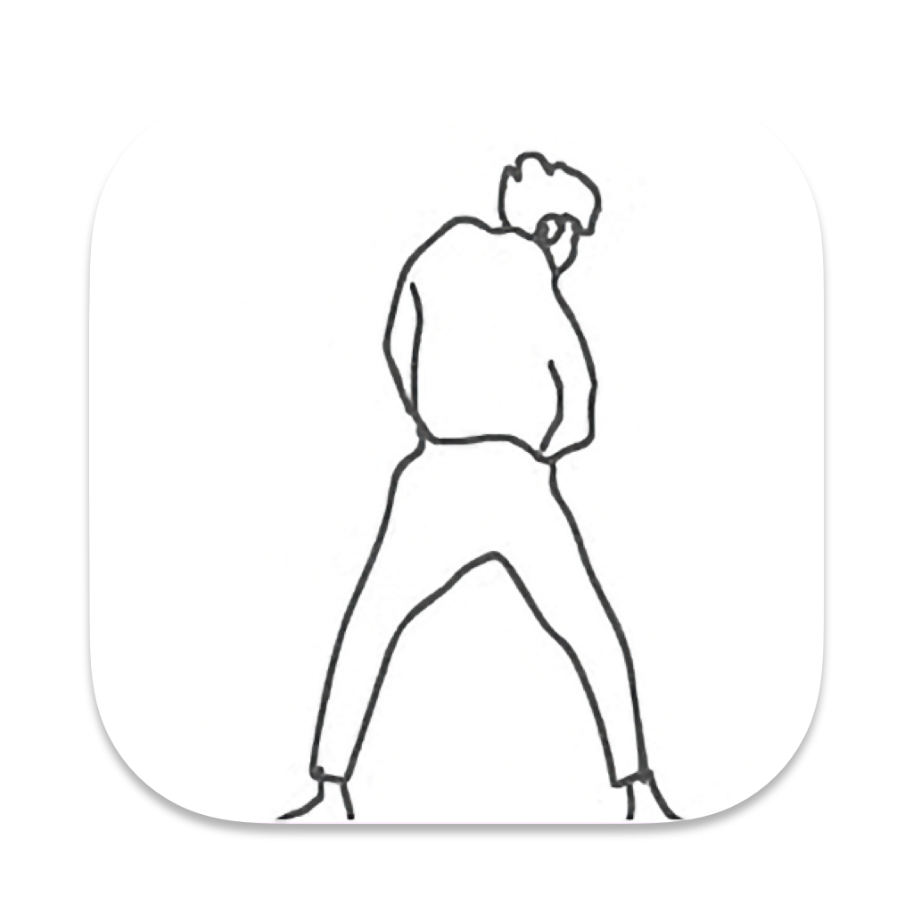

<h1 align="left">不只因</h1>

 

<i>巅峰诞生虚伪的拥护，黄昏见证虔诚的信徒。</i>

# 使用截图

# 注意

因为一些特殊原因，不只因被App Store下架。up表示非常的难过😫 up想了想还是创建一个交流群，方便后续版本更新

QQ群：**739654386**

# 鸣谢

* 灵感来源 https://github.com/Eilgnaw/ZhiYin
