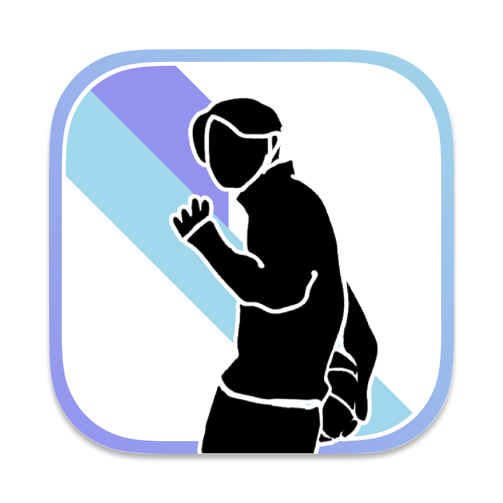
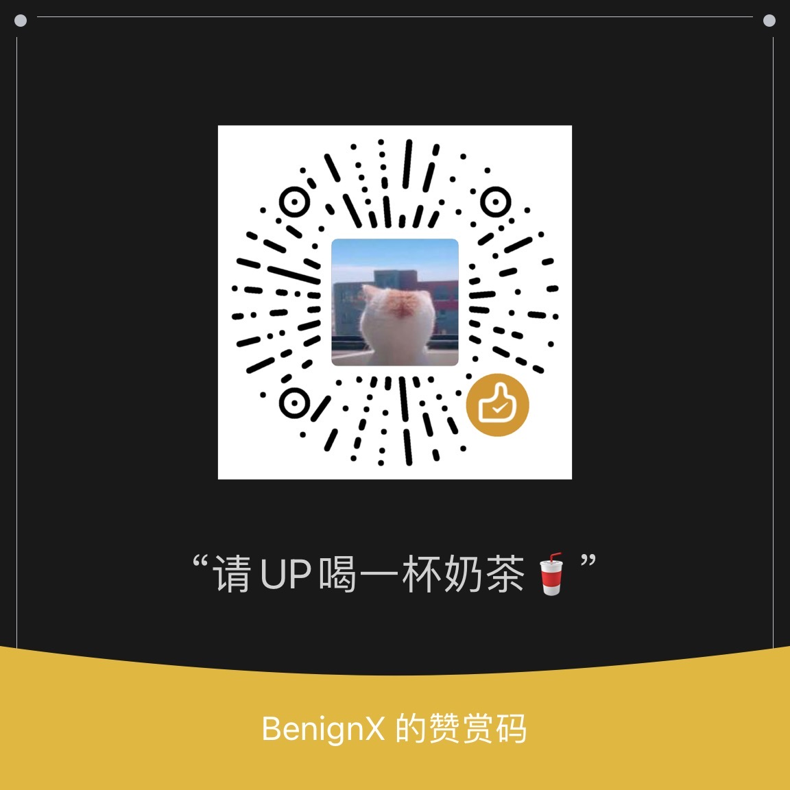

<div style="display: flex; justify-content: space-between; flex:8">
<h1 align="left">不只因</h1>
<div align="left">


<a href="https://jq.qq.com/?_wv=1027&k=8Z9w4LGN"></a>
<br>

<i>巅峰诞生虚伪的拥护，黄昏见证虔诚的信徒。</i>

<a href="https://github.com/W-Mai/BuZhiYin/stargazers"></a>
<a href="https://github.com/W-Mai/BuZhiYin/network/members"></a>
<a href="https://github.com/W-Mai/BuZhiYin/issues"></a>
<a href="https://github.com/W-Mai/BuZhiYin/blob/master/LICENSE"></a>

</div>
</div>

<a href="https://apps.apple.com/app/apple-store/id6446803018?pt=126160538&ct=github&mt=8" target="_blank">  </a>

### Bilibili 高燃剪辑：https://www.bilibili.com/video/BV1Kj411M7Yc/

# 使用截图
<br />
<div align="center">

</div>
<br />
<div align="center">
<div style="display: flex; width: 400px; align-items: start;justify-content: center;">


</div>

<div style="display: flex; width: 400px; align-items: start;justify-content: center;">


</div>
</div>

# 注意

因为一些特殊原因，不只因`曾经`被App Store下架。up表示非常的难过😫

up想了想还是创建一个交流群，方便交流以及后续版本更新

QQ群：
```cpp
739654386
```

## ✨

[](https://star-history.com/#W-Mai/BuZhiYin&Date)

# 赞赏

### 如果给你带来快乐，小手阔绰，也请up喝一杯奶茶🥤吧！




# 鸣谢

* 灵感来源 https://github.com/Eilgnaw/ZhiYin
